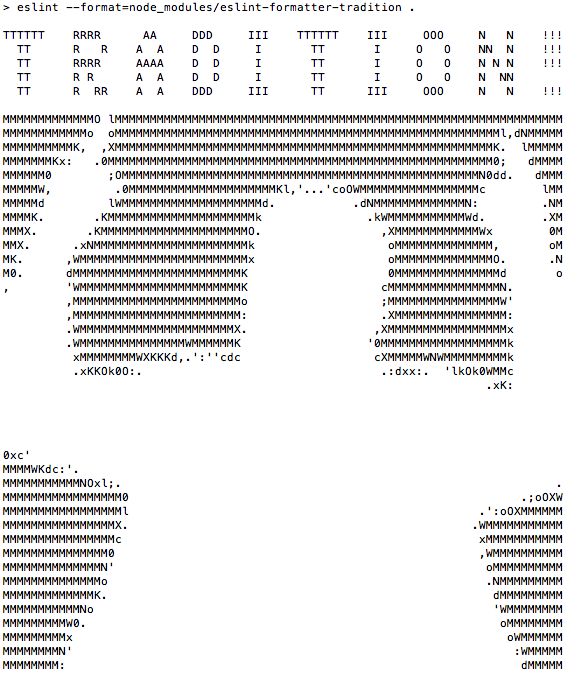

# eslint-formatter-tradition

> Because of ESLint, we've kept our balance for many, many years. Here in Anatevka, we have rules for everything: how to indent, how to eval... how to whitespace... how to use semicolons. For instance, we always use our variables, and always wear a little parentheses that shows our constant devotion to Functions. You may ask, "How did this tradition get started?" I'll tell you!



[This might explain things](https://twitter.com/klamping/status/699996473027465216)

## Install

```
$ npm install --save-dev eslint-formatter-tradition
```

> I don't know. But it's a tradition... and because of our traditions... Every one of us knows who they are and what Standards expects them to do.

## Usage

```
$ eslint --format=node_modules/eslint-formatter-tradition file.js
```

## License

MIT © [Kevin Lamping](https://twitter.com/klamping)

> A fiddler on the roof. Sounds crazy, no? But here, in our little village of Anatevka, you might say every one of us is a fiddler on the roof trying to scratch out a pleasant, simple tune without breaking his neck. It isn't easy. You may ask 'Why do we stay up there if it's so dangerous?' Well, we stay because Anatevka is our home. And how do we keep our balance? That I can tell you in one word: tradition!
